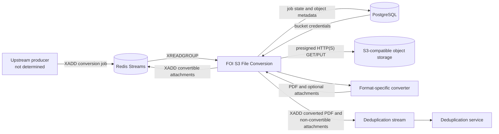
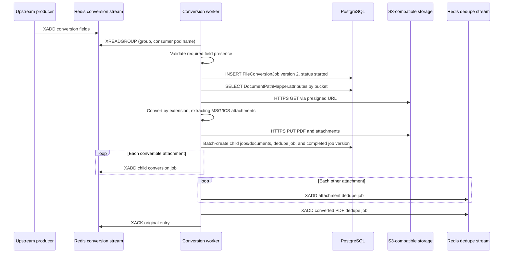

# FOI S3 File Conversion Service

Long-running .NET worker that converts supported records from S3-compatible object storage to PDF and routes the results through the FOI document-review processing pipeline.

> **Evidence boundary:** This document describes behavior visible in this directory and the directly related files in the parent `foi-docreviewer` repository. Where the repository does not establish an operational detail, the text says **Not determined from the repository**.

## Table of contents

- [1. Overview](#1-overview)
- [2. Architecture](#2-architecture)
- [3. Incoming Messages](#3-incoming-messages)
- [4. Outgoing Messages](#4-outgoing-messages)
- [5. End-to-End Message Flow](#5-end-to-end-message-flow)
- [6. Developer Guide](#6-developer-guide)
- [7. Configuration](#7-configuration)
- [8. DevOps / Deployment Guide](#8-devops--deployment-guide)
- [9. Observability](#9-observability)
- [10. Failure Handling](#10-failure-handling)
- [11. Troubleshooting](#11-troubleshooting)
- [12. Repository Structure](#12-repository-structure)
- [13. Quick Start](#13-quick-start)

## 1. Overview

The FOI S3 File Conversion service converts office and messaging files stored in S3-compatible object storage into PDF files suitable for the later stages of the FOI document-review pipeline.

Its responsibilities are to:

- consume conversion jobs from a Redis Stream;
- validate the presence of the job fields required by the worker;
- record `started`, `completed`, or `error` job entries in PostgreSQL;
- retrieve bucket-specific S3 access credentials from PostgreSQL;
- download the source object through a one-hour presigned HTTP(S) URL;
- convert `.xls`, `.xlsx`, `.ics`, `.msg`, `.doc`, `.docx`, `.ppt`, and `.pptx` files to PDF;
- extract attachments from `.ics` and `.msg` files, upload them separately, and route each attachment according to the centrally supplied format lists;
- upload the converted PDF beside the source object; and
- publish the converted PDF and extracted attachments to Redis Streams for conversion or deduplication.

The wider flow evidenced by the repository is:

1. An upstream component creates a `FileConversionJob` and publishes a flat Redis Stream entry. The API code that creates initial jobs is present, but the component that publishes the initial conversion entry is **Not determined from the repository**.
2. This worker converts the object and creates the database records needed by downstream processing.
3. Converted PDFs and non-convertible attachments are sent to the deduplication stream, which is consumed by `computingservices/DedupeServices`.
4. Extracted attachments that also require conversion are sent back to the conversion stream as child jobs.

This is a worker process. It does not expose an HTTP API.

## 2. Architecture



### External systems

| System | Protocol/use | Evidence-backed responsibility |
| --- | --- | --- |
| Redis | Redis Streams | Reads the stream named by `REDIS_STREAM_KEY` with a consumer group; writes converted outputs to `DEDUPE_STREAM_KEY`; writes convertible attachments back to `REDIS_STREAM_KEY`. |
| PostgreSQL | Npgsql/TCP | Reads bucket credentials from `DocumentPathMapper`; writes `FileConversionJob`, `DeduplicationJob`, `DocumentMaster`, and `DocumentAttributes` records. |
| S3-compatible object storage | S3 signing plus HTTP(S) | Generates presigned GET/PUT URLs, downloads source files, and uploads PDFs and extracted attachments. |
| Record-format endpoint | HTTP GET | Supplies JSON arrays named `conversion`, `dedupe`, and `nonredactable` at startup. |

### Internal components

| Component | Responsibility |
| --- | --- |
| `Program.cs` | Loads configuration, initializes logging and the Syncfusion licence, fetches format lists, connects to Redis, validates messages, orchestrates processing, publishes outputs, and acknowledges successful input entries. |
| `DBHandler.cs` | Performs PostgreSQL access and job/document record writes. |
| `S3Handler.cs` | Downloads and uploads objects, chooses a converter by extension, prepares attachment metadata, and creates presigned URLs. |
| `FOIS3ObjectStorageClient.cs` | Creates an AWS SDK S3 client using the configured endpoint and credentials read from PostgreSQL. |
| `ConversionSettings.cs` | Holds process-wide conversion, retry, and format settings. |
| Format-specific projects | Implement Excel, Word, PowerPoint, Outlook MSG, and iCalendar conversion. |

The `MCS.FOI.EMLToPDF` project exists in the solution and container build context, but `S3Handler` does not dispatch `.eml` files to it. Therefore `.eml` is not a verified input type for this worker.

## 3. Incoming Messages

### File conversion job

| Property | Value |
| --- | --- |
| Transport | Redis Stream entry (flat name/value fields, not a single JSON body) |
| Stream | Value of `REDIS_STREAM_KEY`; `file-conversion-local-{initials}` is the local sample |
| Consumer group | Value of `REDIS_STREAM_CONSUMER_GROUP`; sample: `file-conversion-consumer-group` |
| Consumer name | Trimmed `CONSUMER_NAME`; falls back to `<machine-name>-<process-id>` with a startup warning when missing or blank. |
| Producer | Initial producer: **Not determined from the repository**. This service itself produces child conversion jobs for convertible `.msg`/`.ics` attachments. |
| When consumed | Continuously after startup through `StreamReadGroup`; a new group is created at `$`, so it begins after the stream's current tail. |
| Purpose | Request conversion of one S3-hosted source file to PDF. |

#### Payload fields

All fields below are required by `ValidateMessage`. “Type/use” describes subsequent casts in this worker; validation itself checks only that a Redis value is present.

| Field | Required | Type/use | Description |
| --- | --- | --- | --- |
| `s3filepath` | Yes | String URL | Full object URL. The host must match `S3_HOST`; the fourth `/`-separated segment is treated as the bucket. |
| `requestnumber` | Yes | String | FOI request identifier used in logs and forwarded messages. |
| `bcgovcode` | Yes | String | Ministry/organization code used in logs and forwarded messages. |
| `filename` | Yes | String | Display/original filename recorded in jobs and forwarded downstream. |
| `ministryrequestid` | Yes | Integer-compatible Redis value | PostgreSQL ministry-request identifier. |
| `attributes` | Yes | JSON string representing an object | Document metadata. It must deserialize to a mutable JSON object. |
| `batch` | Yes | String | Batch identifier stored and forwarded. |
| `jobid` | Yes | Integer-compatible Redis value | Existing `FileConversionJob` identifier. |
| `documentmasterid` | Yes | Integer-compatible Redis value | Input `DocumentMaster` identifier. |
| `trigger` | Yes | String | Pipeline trigger, such as `recordupload` or `attachment`; allowed values are not validated here. |
| `createdby` | Yes | String | User/audit identity forwarded downstream. |
| `usertoken` | Yes | String | User token forwarded to the dedupe message. Treat as a secret; do not print it in examples or logs. |
| `parentfilepath` | No | String | Added to child conversion messages. This worker does not directly read it. |
| `parentfilename` | No | String | Added to child conversion messages. This worker does not directly read it. |

Example Redis entry, with a deliberately non-functional token:

```bash
redis-cli -h localhost -p 7379 XADD 'file-conversion-local-dev' '*' \
  s3filepath 'https://objectstore.example.gov/example-bucket/FOI-2026-001/source.docx' \
  requestnumber 'FOI-2026-001' \
  bcgovcode 'EXAMPLE' \
  filename 'source.docx' \
  ministryrequestid '1001' \
  attributes '{"extension":".docx","filesize":12345}' \
  batch 'batch-001' \
  jobid '2001' \
  documentmasterid '3001' \
  trigger 'recordupload' \
  createdby 'local-developer' \
  usertoken 'REDACTED_LOCAL_PLACEHOLDER'
```

Equivalent conceptual payload:

```json
{
  "s3filepath": "https://objectstore.example.gov/example-bucket/FOI-2026-001/source.docx",
  "requestnumber": "FOI-2026-001",
  "bcgovcode": "EXAMPLE",
  "filename": "source.docx",
  "ministryrequestid": 1001,
  "attributes": "{\"extension\":\".docx\",\"filesize\":12345}",
  "batch": "batch-001",
  "jobid": 2001,
  "documentmasterid": 3001,
  "trigger": "recordupload",
  "createdby": "local-developer",
  "usertoken": "REDACTED_LOCAL_PLACEHOLDER"
}
```

#### Validation and processing

- The worker rejects a message if any required field is absent.
- It does not explicitly reject empty strings, unknown extra fields, malformed S3 URLs, unsupported extensions, or invalid JSON during `ValidateMessage`; those may fail later.
- `ministryrequestid`, `jobid`, and `documentmasterid` must be convertible by StackExchange.Redis to integers because the database layer casts them.
- `attributes` must parse as a JSON object. On success, the worker adds `convertedfilesize`; for attachments it also sets `filesize`, `isattachment`, `rootparentfilepath`, `lastmodified` when available, `extension`, and `incompatible`.
- The verified conversion extensions are `.xls`, `.xlsx`, `.ics`, `.msg`, `.doc`, `.docx`, `.ppt`, and `.pptx`.

After validation, the worker records the start, downloads and converts the object, uploads outputs, creates completion/downstream job records, publishes downstream entries, acknowledges the input, and logs completion.

#### Incoming-message errors and retries

- Missing required fields produce a warning. The entry is not acknowledged and no error job is written.
- Other processing failures are logged and an `error` version of the `FileConversionJob` is written when that database operation succeeds. The entry is not acknowledged.
- The worker does not call `XAUTOCLAIM`, `XCLAIM`, or read pending entries. No message-level automatic retry or dead-letter stream is implemented here.
- Format converters retry conversion/file-access operations according to `FailureAttemptCount` and `WaitTimeInMilliSeconds`; this is separate from Redis delivery retry.

## 4. Outgoing Messages

The worker emits three variants of flat Redis Stream entries. Redis `StreamAdd` is called synchronously and no explicit publish retry policy is configured.

### Converted PDF ready for deduplication

| Property | Value |
| --- | --- |
| Stream | `DEDUPE_STREAM_KEY` |
| Consumer | The repository's deduplication service |
| When sent | After the converted PDF and any attachments are uploaded and the success database batch completes |
| Purpose | Continue processing the new PDF through deduplication |

| Field | Required/sent | Description |
| --- | --- | --- |
| `s3filepath` | Always | Original path with its extension changed to `.pdf`. |
| `requestnumber`, `bcgovcode`, `ministryrequestid`, `batch`, `trigger`, `createdby`, `usertoken` | Always | Copied from the input. |
| `filename` | Always | Copied unchanged from the input, including its original extension. |
| `attributes` | Always | Input JSON serialized after adding numeric `convertedfilesize`. |
| `jobid` | Always | Newly created `DeduplicationJob` ID. |
| `documentmasterid` | Always | Input document master ID. |
| `outputdocumentmasterid` | Always | Newly created PDF `DocumentMaster` ID. |

Conceptual example:

```json
{
  "s3filepath": "https://objectstore.example.gov/example-bucket/FOI-2026-001/source.pdf",
  "requestnumber": "FOI-2026-001",
  "bcgovcode": "EXAMPLE",
  "filename": "source.docx",
  "ministryrequestid": "1001",
  "attributes": "{\"extension\":\".docx\",\"filesize\":12345,\"convertedfilesize\":45678}",
  "batch": "batch-001",
  "jobid": "4001",
  "documentmasterid": "3001",
  "outputdocumentmasterid": "3002",
  "trigger": "recordupload",
  "createdby": "local-developer",
  "usertoken": "REDACTED_LOCAL_PLACEHOLDER"
}
```

### Extracted attachment requiring conversion

| Property | Value |
| --- | --- |
| Stream | `REDIS_STREAM_KEY` |
| Consumer | Another conversion worker in the same consumer group |
| When sent | For each `.msg` or `.ics` attachment whose lowercase extension occurs in the endpoint's `conversion` array |
| Purpose | Recursively convert a supported attached document |

Sent fields are `s3filepath`, `requestnumber`, `bcgovcode`, `filename`, `ministryrequestid`, `attributes`, `batch`, `parentfilepath`, `parentfilename`, `jobid`, `documentmasterid`, `trigger`, `createdby`, and `usertoken`. `trigger` is set to `attachment`; the parent fields identify the source message/calendar. The job and document IDs are newly created for the attachment.

```json
{
  "s3filepath": "https://objectstore.example.gov/example-bucket/FOI-2026-001/7b25c6c1.docx",
  "requestnumber": "FOI-2026-001",
  "bcgovcode": "EXAMPLE",
  "filename": "attachment.docx",
  "ministryrequestid": "1001",
  "attributes": "{\"filesize\":9876,\"isattachment\":true,\"rootparentfilepath\":\"https://objectstore.example.gov/example-bucket/FOI-2026-001/source.msg\",\"extension\":\".docx\",\"incompatible\":false}",
  "batch": "batch-001",
  "parentfilepath": "https://objectstore.example.gov/example-bucket/FOI-2026-001/source.msg",
  "parentfilename": "source.msg",
  "jobid": "2002",
  "documentmasterid": "3003",
  "trigger": "attachment",
  "createdby": "local-developer",
  "usertoken": "REDACTED_LOCAL_PLACEHOLDER"
}
```

### Extracted attachment sent directly to deduplication

| Property | Value |
| --- | --- |
| Stream | `DEDUPE_STREAM_KEY` |
| Consumer | The repository's deduplication service |
| When sent | For each extracted attachment whose lowercase extension is not in the endpoint's `conversion` array |
| Purpose | Bypass conversion and continue processing the attachment |

Sent fields are `s3filepath`, `requestnumber`, `bcgovcode`, `filename`, `ministryrequestid`, `attributes`, `batch`, `jobid`, `documentmasterid`, `incompatible`, `trigger`, `createdby`, and `usertoken`. `trigger` is `attachment`. `incompatible` is the lower-case string representation of the calculated attachment attribute, defaulting to `false` if absent.

```json
{
  "s3filepath": "https://objectstore.example.gov/example-bucket/FOI-2026-001/ee43c909.pdf",
  "requestnumber": "FOI-2026-001",
  "bcgovcode": "EXAMPLE",
  "filename": "attachment.pdf",
  "ministryrequestid": "1001",
  "attributes": "{\"filesize\":2345,\"isattachment\":true,\"rootparentfilepath\":\"https://objectstore.example.gov/example-bucket/FOI-2026-001/source.msg\",\"extension\":\".pdf\",\"incompatible\":false}",
  "batch": "batch-001",
  "jobid": "4002",
  "documentmasterid": "3004",
  "incompatible": "false",
  "trigger": "attachment",
  "createdby": "local-developer",
  "usertoken": "REDACTED_LOCAL_PLACEHOLDER"
}
```

### Outgoing publish errors

An exception from a Redis publish enters the general processing failure path. The worker attempts to record the conversion job as `error` and leaves the input entry pending/unacknowledged. There is no transactional outbox, publish retry loop, or rollback of earlier S3/database/Redis effects; see [Failure Handling](#10-failure-handling).

### Redis completion marker

After all downstream messages are added, the worker writes a Redis string key named `<input-stream-entry-id>:lastid` whose value is that same stream entry ID. It then acknowledges the input. This marker is written for every successful message, but no code in this service reads it, and its intended consumer or expiry policy is **Not determined from the repository**.

### Other outbound interactions

These are synchronous dependency calls rather than queue messages:

| Interaction | When | Payload/result | Failure behavior |
| --- | --- | --- | --- |
| `GET RECORD_FORMATS` | Once during startup | Expects a JSON object with `conversion`, `dedupe`, and `nonredactable` arrays. | Non-success status, connection failure, or invalid content reaches the top-level fatal handler and stops the worker loop. No explicit retry. |
| Presigned HTTP(S) GET | Once per input | Downloads the object identified by `s3filepath`. | Non-success status raises and enters processing failure handling. No explicit HTTP retry or timeout. |
| Presigned HTTP(S) PUT | Once for the PDF and once per extracted attachment | Uploads an `application/octet-stream` body. | Non-success status raises and enters processing failure handling. Already completed uploads are not rolled back. |
| PostgreSQL commands | At job start, credential lookup, and job completion/failure | Parameterized job/document writes except the bucket credential query, which concatenates the parsed bucket into SQL. | Exceptions are logged and rethrown. There is no application retry; the completion records use one `NpgsqlBatch`, but external S3/Redis effects are not part of its transaction. |

## 5. End-to-End Message Flow



The successful path is therefore:

```text
Redis entry -> field-presence validation -> job-start record -> credential lookup
-> presigned download -> format-specific conversion -> presigned upload
-> database completion/downstream records -> outgoing Redis entries -> XACK
```

## 6. Developer Guide

### Prerequisites

- Git.
- .NET SDK 7.0, matching every active project target (`net7.0`). The repository does not pin a patch version with `global.json`.
- Docker with Compose, if using the parent repository's Redis/PostgreSQL services or building the runtime image.
- Reachability to a Redis server, PostgreSQL database, S3-compatible endpoint, and record-format HTTP endpoint.
- A valid Syncfusion licence for licensed conversion libraries.
- Bucket credentials stored in `DocumentPathMapper.attributes` as JSON containing `s3accesskey` and `s3secretkey`.
- The database schema used by the parent API migrations and pre-existing input `FileConversionJob`/`DocumentMaster` records.

The container additionally installs font, X11/GTK, Chromium-style, Skia, and `libgdiplus` runtime libraries used by the document renderers.

> **Dependency maintenance:** Current SDK restore/build output reports that .NET 7 is out of support and flags known-vulnerability advisories for the pinned `Npgsql` 7.0.0, `SkiaSharp` 2.88.3, and `System.Drawing.Common` 5.0.2 packages. Review and test framework/package upgrades before production rollout.

### Restore and build

From this directory:

```bash
dotnet restore MCS.FOI.S3FileConversion.sln
dotnet build MCS.FOI.S3FileConversion.sln --configuration Debug
```

Release publish:

```bash
dotnet publish MCS.FOI.S3FileConversion/MCS.FOI.S3FileConversion.csproj \
  --configuration Release \
  --output ./artifacts/publish
```

### Start local infrastructure

The parent repository provides Redis on host port `7379` and PostgreSQL on host port `25432`:

```bash
cp ../sample.env ../.env
# Edit ../.env and replace placeholders; never commit it.
docker compose --file ../docker-compose.yml up -d \
  foi-docreviewer-redis foi-docreviewer-db
```

The Compose definition starts containers but does not by itself prove that the complete database schema and required seed rows are installed. Apply the parent API migrations and seed the required job, document, and `DocumentPathMapper` data using the wider project's established development process. A standalone seed procedure is **Not determined from the repository**.

### Configure and run the worker

Use shell-local placeholder values; do not save real credentials in this README or tracked files.

```bash
export DATABASE_HOST='localhost'
export DATABASE_PORT='25432'
export DATABASE_NAME='foi'
export DATABASE_USERNAME='local-user'
export DATABASE_PASSWORD='local-password'
export REDIS_STREAM_HOST='localhost'
export REDIS_STREAM_PORT='7379'
export REDIS_STREAM_PASSWORD=''
export REDIS_STREAM_KEY='file-conversion-local-dev'
export REDIS_STREAM_CONSUMER_GROUP='file-conversion-consumer-group'
export DEDUPE_STREAM_KEY='foi-dedupe-local-dev'
export S3_HOST='objectstore.example.gov'
export RECORD_FORMATS='https://config.example.gov/record-formats.json'
export FILE_CONVERSION_SYNCFUSIONKEY='your-local-licence-key'

dotnet run --project MCS.FOI.S3FileConversion/MCS.FOI.S3FileConversion.csproj
```

There is no separate development-mode profile or hot-reload configuration. `dotnet watch` can restart the process after source changes:

```bash
dotnet watch --project MCS.FOI.S3FileConversion/MCS.FOI.S3FileConversion.csproj run
```

### Tests

The solution contains MSTest projects for Calendar, Word, Excel, MSG, PowerPoint,
and S3 file-conversion components. Its containerized integration project exercises
Redis, PostgreSQL, and S3 orchestration through the supported wrapper below; when
that project is discovered outside Compose, its end-to-end test is reported as
inconclusive with guidance to use the wrapper.

```bash
dotnet test MCS.FOI.S3FileConversion.sln --configuration Debug
```

Important limitations in the checked-in tests:

- Excel tests require `SourceRootPath` to point to `MCS.FOI.ExcelToPDFUnitTests/SourceExcel`.
- Calendar, MSG, Word, and PowerPoint tests contain hard-coded Windows source paths and may require local path edits before they can run elsewhere.
- The Word test references `Ministers Housing Weekly 2023 12 19 DRAFT - TEST.docx`, which is not present among the checked-in fixtures.
- Some tests write result PDFs into fixture directories.
- `test.runsettings` contains a machine-specific Windows `SourceRootPath`.

Example for Excel tests on Linux/macOS:

```bash
SourceRootPath="$PWD/MCS.FOI.ExcelToPDFUnitTests/SourceExcel" \
  dotnet test MCS.FOI.ExcelToPDFUnitTests/MCS.FOI.ExcelToPDFUnitTests.csproj
```

#### Containerized DOCX integration test

Docker with Compose v2 is required. Run the supported local and CI entry
point from this service directory:

```bash
./integration/run.sh
```

The command builds and runs the production worker entry point with
health-checked PostgreSQL, Redis, SeaweedFS, and a record-formats stub.
It uses static test-only credentials, no protected secrets, and exposes no
service ports to the host. The runner waits for the worker's Redis consumer
group, publishes one DOCX conversion, and uses a 60-second conversion
deadline.

The database fixture intentionally defines only the worker's five-table
contract: `DocumentPathMapper`, `DocumentMaster`, `DocumentAttributes`,
`FileConversionJob`, and `DeduplicationJob`. The test verifies the source
and PDF objects, database job/document state, the downstream dedupe-stream
entry, and input acknowledgement. It stops at the dedupe-stream boundary and
does not run a deduplication consumer.

Results are written beneath `TestResults/integration/`:

- `docx-integration.trx` contains the MSTest result.
- `compose.log` contains Compose status and logs for failure diagnosis.

### Formatting and linting

No repository-specific .NET linter or formatting configuration is present in this service. The SDK formatter can still check standard formatting:

```bash
dotnet format MCS.FOI.S3FileConversion.sln --verify-no-changes
```

### Debugging

1. Run the worker from Visual Studio, Rider, or VS Code with the environment variables from [Configuration](#7-configuration).
2. Set breakpoints in `Program.Main`, `S3Handler.ConvertFile`, and `DBHandler.recordJobEnd`.
3. Use a unique local Redis stream name to avoid consuming another developer's jobs.
4. Inspect Redis pending entries and PostgreSQL job versions while stepping through the worker.

Because the process loops continuously and performs a non-blocking stream read, pause/break behavior may show repeated reads when no entries are available.

### Simulate and verify messaging

Before sending the sample from [Incoming Messages](#3-incoming-messages), upload the referenced source object and create matching database records. Then:

```bash
redis-cli -h localhost -p 7379 XINFO GROUPS 'file-conversion-local-dev'
redis-cli -h localhost -p 7379 XRANGE 'foi-dedupe-local-dev' '-' '+'
redis-cli -h localhost -p 7379 XPENDING \
  'file-conversion-local-dev' 'file-conversion-consumer-group'
```

Verify the converted object with the configured S3 client or console at the original key with its extension replaced by `.pdf`. Verify database state with a read-only query:

```sql
SELECT fileconversionjobid, version, status, filename, message
FROM "FileConversionJob"
WHERE fileconversionjobid = 2001
ORDER BY version;
```

## 7. Configuration

`Program` reads optional `appsettings.json` and then environment variables. The main infrastructure values are read directly from the environment, so the environment variables below are required for a functional worker even though startup does not perform explicit configuration validation.

| Variable | Required | Default | Description |
| -------- | -------- | ------- | ----------- |
| `DATABASE_HOST` | Yes | None | PostgreSQL host. |
| `DATABASE_PORT` | Yes | None | PostgreSQL port. |
| `DATABASE_NAME` | Yes | None | PostgreSQL database name. |
| `DATABASE_USERNAME` | Yes | None | PostgreSQL application username. Secret-backed in deployment. |
| `DATABASE_PASSWORD` | Yes | None | PostgreSQL password. Secret-backed; never log or commit it. |
| `REDIS_STREAM_HOST` | Yes | None | Redis host. |
| `REDIS_STREAM_PORT` | Yes | None | Redis port. |
| `REDIS_STREAM_PASSWORD` | Conditional | None | Redis password; required when the Redis server enforces authentication. |
| `REDIS_STREAM_KEY` | Yes | None | Input conversion stream and target for convertible attachments. |
| `REDIS_STREAM_CONSUMER_GROUP` | Yes | None | Redis consumer-group name. |
| `CONSUMER_NAME` | Required in Kubernetes/OpenShift; optional locally | `<machine-name>-<process-id>` | Inject `metadata.name` through the Downward API. Missing or blank values emit a startup warning. |
| `DEDUPE_STREAM_KEY` | Yes | None | Output stream for converted PDFs and other extracted attachments. |
| `S3_HOST` | Yes | None | S3-compatible service endpoint. Explicit `http://` and `https://` schemes are preserved; a scheme-less host defaults to HTTPS. |
| `RECORD_FORMATS` | Yes | None | HTTP(S) URL returning `conversion`, `dedupe`, and `nonredactable` arrays. Startup fails if the request/status/JSON shape fails. |
| `FILE_CONVERSION_SYNCFUSIONKEY` | Operationally yes | Empty `ConversionSettings:SyncfusionLicense` | Syncfusion licence key. |
| `FILE_CONVERSION_FAILTUREATTEMPT` | No | `5` | Maximum converter attempts. The misspelling `FAILTURE` is the actual contract. Values below `1` fall back to the JSON default. |
| `FILE_CONVERSION_WAITTIME` | No | `5000` | Milliseconds between converter attempts. `0` or invalid values fall back to the JSON default. |
| `FILE_CONVERSION_OPENFILE_WAITTIME` | No | `120` | Seconds allowed for the initial Excel workbook open. `0` or invalid values fall back to the JSON default. |

The parent Compose/OpenShift files also pass `S3_REGION` and `S3_SERVICE`, but this worker does not read them.

Relevant `appsettings.json` keys:

| Key | Default | Use |
| --- | --- | --- |
| `ConversionSettings:FailureAttemptCount` | `5` | Fallback for the misspelled failure-attempt environment variable. |
| `ConversionSettings:WaitTimeInMilliSeconds` | `5000` | Fallback retry delay. |
| `ConversionSettings:OpenFileWaitTimeInSeconds` | `120` | Fallback Excel-open timeout. |
| `ConversionSettings:SyncfusionLicense` | Empty | Fallback licence value. |
| `ConversionSettings:FileWatcherMonitoringDelayInMilliSeconds` | `5000` | Loaded into `ConversionSettings`, but no file watcher or delay uses it in the current worker loop. |
| `Serilog:*` | Debug minimum, console/debug sinks | Structured logging configuration. |

Other legacy keys under `EventHub` and `ConversionSettings` are present but are not used by the active processing path.

Expected record-format response:

```json
{
  "conversion": [".doc", ".docx", ".xls", ".xlsx", ".msg", ".ics", ".ppt", ".pptx"],
  "dedupe": [".pdf"],
  "nonredactable": [".example"]
}
```

These values are illustrative. The authoritative lists are whatever the configured endpoint returns.

## 8. DevOps / Deployment Guide

### Container build

The current `Dockerfile` is a multi-stage build:

1. `mcr.microsoft.com/dotnet/sdk:10.0-noble` restores and publishes `MCS.FOI.S3FileConversion` in Release mode.
2. `mcr.microsoft.com/dotnet/runtime:10.0-noble` installs fonts and native rendering dependencies.
3. The published output is copied to `/app`.
4. The container starts with `dotnet MCS.FOI.S3FileConversion.dll`.

Build locally:

```bash
docker build --tag foi-s3-fileconversion:local .
```

`Dockerfile` downloads `fonts.zip` from a B.C. Government object-store URL during the image build. The build therefore requires outbound HTTPS access to that endpoint as well as access to Microsoft container images, Debian package repositories, and NuGet sources.

`Docker.bcgov` uses .NET 6 images while the projects target .NET 7 and omits the PowerPoint project copy steps. It does not match the current project targets and should be treated as a legacy artifact unless separately corrected and verified.

### Local Compose

The parent `docker-compose.yml` defines `foi-s3-fileconversion`, depends on Redis and PostgreSQL, builds this directory's `Dockerfile`, and injects most service variables. It does not pass `FILE_CONVERSION_OPENFILE_WAITTIME`, so the JSON default applies.

```bash
docker compose --file ../docker-compose.yml build foi-s3-fileconversion
docker compose --file ../docker-compose.yml up foi-s3-fileconversion
```

### CI/CD

The current GitHub Actions flow is:

1. `.github/workflows/ci-build-images.yml` detects changes by service path using `.github/configuration/service-catalog.yaml`.
2. It builds this directory's `Dockerfile`, tags the image with the PR number (or a manual tag), and pushes `reviewer-conversion` to the OpenShift registry.
3. After merge, `.github/workflows/cd-auto-deploy.yml` updates `reviewer-conversion` and `reviewer-conversion-largefiles` image tags in an external GitOps repository.
4. Argo CD applies that repository's manifests; the workflow waits for the OpenShift deployment rollout and verifies the image tag.
5. `.github/workflows/prod-release.yml` manually promotes release-labelled test images and updates production GitOps values.

The live Helm manifests and values are in the external GitOps repository and are **Not determined from this repository**.

### Checked-in OpenShift templates

`../openshift/templates/fileconv-deploy.yaml` and `fileconv-largefiles-deploy.yaml` are older `DeploymentConfig` templates. They show:

- rolling deployment strategy;
- one replica;
- `50m` CPU / `250Mi` memory requests;
- `150m` CPU / `500Mi` memory limits;
- `30` second pod termination grace period;
- secret references for database, S3, Redis, format, licence, and retry configuration; and
- separate stream keys for the large-file deployment.

The normal template omits several variables required by current code, including `DEDUPE_STREAM_KEY`, `RECORD_FORMATS`, and the Syncfusion/retry values. The large-file template contains them. The templates are not the current GitOps source of truth.

Both standard and large-file conversion deployments must inject `CONSUMER_NAME`
from `metadata.name`:

```yaml
- name: CONSUMER_NAME
  valueFrom:
    fieldRef:
      fieldPath: metadata.name
```

Configure the live GitOps manifests before or alongside the application
rollout; the checked-in legacy templates are not the live source of truth.
Older application images ignore this additional variable.

`fileconv-build.yaml` references `Dockerfile.local`, which is not present in this directory. Current GitHub Actions uses `Dockerfile` directly.

### Runtime requirements

- Outbound TCP to PostgreSQL and Redis.
- Outbound HTTPS to `RECORD_FORMATS` at startup.
- Outbound HTTPS to the configured S3-compatible endpoint for presigned GET/PUT operations.
- No inbound application port is opened by the Dockerfile or application.
- No Service, Route/Ingress, or network-policy requirements are defined for inbound traffic.

### Health checks

The application exposes no health endpoint or listener. No liveness, readiness, or startup probes are present in the checked-in OpenShift templates. Current external GitOps probe configuration is **Not determined from this repository**.

### Secrets management

Checked-in OpenShift templates source credentials and service settings from Kubernetes/OpenShift Secrets. GitHub Actions uses repository secrets for registry and cluster/GitOps access. Do not store database passwords, Redis passwords, S3 credentials, Syncfusion keys, or user tokens in source control.

S3 access keys are not configured as worker environment variables: they are stored in `DocumentPathMapper.attributes` and selected by bucket at runtime. Database encryption or external secret wrapping of those JSON attributes is **Not determined from the repository**.

### Scaling and shutdown

- The checked-in templates use one replica; the service processes stream entries sequentially inside a single loop.
- Each pod uses its pod name as the Redis consumer name, assuming one worker
  per pod. The value is resolved once at startup. Local fallback uses machine
  name plus process ID and is not a cross-host uniqueness guarantee.
- Container restarts in the same pod reuse its name; replacement pods use
  their own names. Existing pending entries remain with their original
  consumer, including `c1`. This change does not recover the backlog or
  establish that every aspect of horizontal scaling is safe.
- CPU- and memory-heavy converters and in-memory input/output streams make resource needs depend strongly on document size. The separate `largefiles` deployment indicates workload separation, but its size threshold/routing policy is **Not determined from the repository**.
- The process does not register a cancellation token or signal handler. `using`/`finally` cleanup runs on normal managed exit, but graceful completion of an in-flight job after SIGTERM is not implemented explicitly. The checked-in pod grace period is 30 seconds.

## 9. Observability

### Logging

Serilog writes structured logs to stdout and the debug sink. The default Serilog minimum is `Debug`, with `Microsoft` and `System` overridden to `Warning`. Each consumed job pushes these properties into the log context:

- `ConsumerName`
- `RequestNumber`
- `BCGovCode`
- `MinistryRequestId`
- `JobId`
- `Filename`
- `Filepath`

Useful messages include:

- `MCS FOI S3FileConversion Service is up`
- `Connecting to Redis stream ...`
- `Job started`
- `File conversion completed in ... ms`
- `Queued converted file to DEDUPE STREAM ...`
- `Job completed successfully`
- `Job skipped — missing required field`
- `Error converting file`
- `Unhandled error in FOI File Conversion service`

The Redis connection log includes `ConsumerName`. If `CONSUMER_NAME` is missing or
blank, startup emits one warning with the selected machine/PID fallback.

The worker forwards `usertoken` in messages but does not add it to the structured log context. Exception messages and stack traces may still contain sensitive operational details and should be access-controlled.

### Metrics, tracing, dashboards, and alerts

- Application metrics: **Not determined from the repository**; no metrics exporter is configured.
- Distributed tracing: **Not determined from the repository**; no tracing instrumentation is configured.
- Dashboards: **Not determined from the repository**.
- Alert rules: **Not determined from the repository**.

### Operational inspection

```bash
# Local container logs
docker compose --file ../docker-compose.yml logs -f foi-s3-fileconversion

# OpenShift logs (current resource name is evidenced by the service catalog)
oc logs deployment/reviewer-conversion --follow

# Stream/group state
redis-cli -h "$REDIS_STREAM_HOST" -p "$REDIS_STREAM_PORT" \
  XINFO GROUPS "$REDIS_STREAM_KEY"

# Pending messages for this group
redis-cli -h "$REDIS_STREAM_HOST" -p "$REDIS_STREAM_PORT" \
  XPENDING "$REDIS_STREAM_KEY" "$REDIS_STREAM_CONSUMER_GROUP"
```

If Redis requires authentication, supply it securely through the client environment/configuration; avoid putting the password directly in shell history.

Failed conversion processing is visible through error logs, `FileConversionJob` rows with `status = 'error'`, and entries remaining in the Redis pending-entry list.

## 10. Failure Handling

| Concern | Verified behavior |
| --- | --- |
| Converter retry | Word, Excel, PowerPoint, MSG, and calendar file-access/conversion paths contain retry loops. Defaults are 5 attempts with 5 seconds between attempts; Excel also has a 120-second workbook-open timeout. |
| Redis message retry | Not implemented. Failed entries remain pending and are not reclaimed/read by this worker. |
| Dead-letter queue | Not implemented for this service. |
| Redis/S3/DB timeout | No explicit Redis, general HTTP, S3-download/upload, or PostgreSQL command timeout is set by application code. Library defaults apply. |
| Duplicate handling | No idempotency key check or duplicate guard is implemented. Database constraints, if any, are not handled as an idempotency mechanism here. |
| Atomicity | S3 writes, PostgreSQL writes, and Redis publishes are separate operations. There is no cross-system transaction or outbox. |
| Acknowledgement | The input is acknowledged only after uploads, success DB writes, and all output publishes complete. |
| Missing fields | Warning only; no ACK and no database error record. |
| Conversion/dependency failure | Logs error, attempts to insert an error job version, and leaves the Redis entry pending. |
| Startup failure | Format endpoint, Redis connection, or other top-level failures are logged as fatal; `Main` then exits without explicitly setting a non-zero exit code. |

### Partial-failure implications

A failure after uploading an object or publishing one of several output messages can leave durable side effects while the input remains pending. Manual replay can therefore create duplicate database rows, duplicate stream entries, or overwritten PDF objects. Recovery must inspect all three systems before replaying.

### Recovery procedure

1. Correlate the entry using its Redis ID and the structured job fields.
2. Inspect `XPENDING`/`XRANGE`, the related `FileConversionJob` versions, downstream `DeduplicationJob` rows, and the expected S3 PDF/attachment objects.
3. Correct the dependency, data, or configuration issue.
4. Decide whether to acknowledge, claim/replay, or reconstruct the job based on already-created side effects.
5. Verify downstream messages and database records after recovery.

Exact production replay/claim commands and ownership policy are **Not determined from the repository**. Do not blindly `XADD` a failed job without checking for partial outputs.

Do not delete `c1`, recreate the consumer group, reset its position, or replay
pending entries as part of this identity change. An image rollback restores
the old shared identity but does not migrate or recover entries pending under
pod-specific consumers.

## 11. Troubleshooting

| Symptom | Checks and resolution |
| --- | --- |
| Service logs a fatal error at startup | Confirm all required environment variables. Fetch `RECORD_FORMATS` manually and verify HTTP success plus the three expected arrays. Confirm Redis DNS/port/password. |
| Cannot connect to Redis | Check `REDIS_STREAM_HOST`, `REDIS_STREAM_PORT`, and conditional password; test network reachability; inspect Redis logs. The local Compose port is `7379`, not container port `6379`. |
| Messages are not consumed | Check `XLEN`, `XINFO GROUPS`, and `XPENDING`. A newly created group starts at `$` and ignores entries that already existed. Failed entries remain pending and are not automatically reclaimed. Ensure the worker and producer use the same stream. |
| Messages remain pending | Inspect worker errors and DB job state. This code only reads new group entries and contains no pending-entry recovery loop. Follow the reviewed operational replay procedure. |
| Converted/dedupe message is absent | Check conversion logs, S3 output, DB completion batch, and the exact `DEDUPE_STREAM_KEY`. The input is ACKed only after the outgoing adds succeed. |
| S3 download/upload fails | Ensure `S3_HOST` matches the prefix in `s3filepath`, the bucket is the fourth URL segment, and `DocumentPathMapper.attributes` contains valid credentials for that bucket. Presigned URLs expire after one hour. |
| S3 credential lookup returns no usable values | Verify a `DocumentPathMapper` row exists for the parsed bucket and that `attributes` contains `s3accesskey` and `s3secretkey`. |
| PostgreSQL connection fails | Check all five `DATABASE_*` values, DNS/network policy, credentials, database existence, and migration state. |
| Job insert fails | Confirm the input job/document IDs exist as required by schema relationships and numeric fields are valid integers. Review all `FileConversionJob` versions for duplicate/conflicting rows. |
| Unsupported extension produces an empty/error PDF | `S3Handler` has no default switch branch. Ensure the central `conversion` list routes only the eight extensions implemented by this worker. |
| Syncfusion licence error | Set `FILE_CONVERSION_SYNCFUSIONKEY` to a valid secret value or provide the JSON fallback; do not commit the key. |
| Excel conversion times out | Increase `FILE_CONVERSION_OPENFILE_WAITTIME` if justified and inspect document size/complexity and pod resources. |
| Font/layout output differs | Confirm the container image successfully downloaded/installed the required fonts and native rendering libraries. Local host execution may not have the same font set. |
| Container health check fails | The worker has no HTTP health endpoint. Remove HTTP probes or add an appropriate external/process-based check in the deployment; current live probe behavior is not in this repository. |
| CPU usage is high while idle | The loop performs non-blocking reads with no sleep when no messages are returned. This is current code behavior; there is no polling-delay setting wired into the loop. |
| Tests fail to find fixtures | Set `SourceRootPath` for Excel. Other test projects contain hard-coded Windows paths and require adaptation for the executing machine. |

## 12. Repository Structure

```text
MCS.FOI.S3FileConversion.sln       .NET solution
MCS.FOI.S3FileConversion/          Worker orchestration, Redis, DB, and S3 code
  Program.cs                       Process entry point and message loop
  S3Handler.cs                     Object I/O, conversion dispatch, attachments
  DBHandler.cs                     PostgreSQL reads and job/document writes
  Utilities/                       Conversion settings and S3 client factory
  appsettings.json                 Logging and conversion defaults
MCS.FOI.ExcelToPDF/                Excel converter (.xls, .xlsx)
MCS.FOI.DocToPDF/                  Word converter (.doc, .docx)
MCS.FOI.PptToPDF/                  PowerPoint converter (.ppt, .pptx)
MCS.FOI.MSGToPDF/                  Outlook message converter (.msg)
MCS.FOI.CalendarToPDF/             iCalendar converter (.ics)
MCS.FOI.EMLToPDF/                  EML converter library; not dispatched by worker
MCS.FOI.*UnitTests/                MSTest converter tests and fixtures
Dockerfile                         Current .NET 7 multi-stage image build
Docker.bcgov                       Legacy/inconsistent .NET 6 image definition
test.runsettings                   Machine-specific MSTest environment example
../docker-compose.yml              Parent-repository local service composition
../sample.env                      Parent-repository environment template
../openshift/templates/fileconv-*  Legacy OpenShift build/deploy templates
../.github/workflows/              Current image build and GitOps deployment flows
```

## 13. Quick Start

This is the shortest repository-backed path. A successful end-to-end conversion still requires valid object storage, the migrated/seeded parent database, and a record-format endpoint.

1. Clone and enter the service directory:

   ```bash
   git clone https://github.com/bcgov/foi-docreviewer.git
   cd foi-docreviewer/MCS.FOI.S3FileConversion
   ```

2. Create the parent environment file and replace placeholders:

   ```bash
   cp ../sample.env ../.env
   ${EDITOR:-vi} ../.env
   ```

3. Restore dependencies:

   ```bash
   dotnet restore MCS.FOI.S3FileConversion.sln
   ```

4. Start Redis and PostgreSQL:

   ```bash
   docker compose --file ../docker-compose.yml up -d \
     foi-docreviewer-redis foi-docreviewer-db
   ```

5. Apply the parent API migrations/seed data, upload a supported source object, and configure the environment variables shown in [Developer Guide](#configure-and-run-the-worker). The exact all-in-one seed command is **Not determined from the repository**.

6. Run the worker:

   ```bash
   dotnet run --project MCS.FOI.S3FileConversion/MCS.FOI.S3FileConversion.csproj
   ```

7. In another shell, submit the sanitized `XADD` example from [Incoming Messages](#file-conversion-job), changing the IDs, host, bucket, and object key to match the prepared local data.

8. Verify the result:

   ```bash
   redis-cli -h localhost -p 7379 XRANGE 'foi-dedupe-local-dev' '-' '+'
   redis-cli -h localhost -p 7379 XPENDING \
     'file-conversion-local-dev' 'file-conversion-consumer-group'
   ```

   A successful run creates the `.pdf` object, publishes a dedupe entry, records completed job state, and removes the input entry from the consumer group's pending list through `XACK`.
