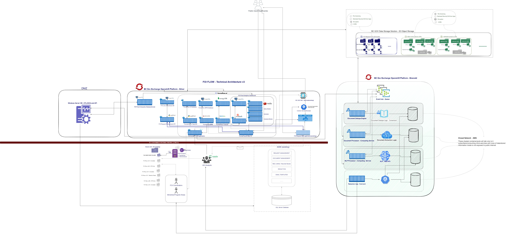

# FOI Dedupe, Document Extraction ,  NLP Services and related Data, Document Storage

## Introduction
FOI Dedupe, Document extraction and NLP Services described in this documentation will be a value added service(s) on top of current FOI FLOW implementation. These services will support FOI FLOW application for document review, harms assessment and Redaction(PII, Confidentials etc.).  Functionally various personas on FOI FLOW app like IAO Analysts, Ministry level FOI Coordinators can ease their effort while doing document deduplication, document review and redaction on digital records having PII and other confidential data. All the components, services described and listed under FOI FLOW, Dedupe, NLP Architecture has restricted access and is available only with in BC Government network.

## Architecture and Design
### Architecture

The above architecture diagram describes full architecture of FOI FLOW ( on left - OCP Silver) , with the new Dedupe , NLP Services which will be deployed on BC GOV Emerald Cluster (on Right). For the purpose of elaborating Dedupe and related services along with the data storage , please follow below subsection of the above diagram.

#### Component or MicroService specific description
**EventHub** : This component or tool will be used for the purpose of storing persistent event message stream from various Producer components(aka Publishers!) and trigger its corresponding Consumer components or microservices(aka Subscriber!) to do related task in a disconnected - loosely coupled manner. All the below consumer components will have their dedicated "STREAM TOPIC/KEY" to listen to their channel of messages from PRODUCER. For instance, we have "Records Upload" component on our FOI FLOW app, which will be a PRODUCER for our "Dedupe Service/Engine" to CONSUME messages for its actions. Based on our analysis , we decided to go ahead with [REDIS STREAMS](https://redis.io/docs/data-types/streams-tutorial/) as our Event Hub. Apache Kafka was our ideal choice, but decided to go with REDIS STREAM due to certain technical and implementation reasons. This component has no Protected C data stored, but only few kind of metadata on records like Document Path, Identifiers, Minisitry codes etc. Hence this will be in a LOW security data zone/tag in EMERALD 

**Dedupe Services / Engine** : This will be a python based custom application or computing micro-service, which has shared datastore with other components like REDACTION API. This component will be CONSUMER and PRODUCER at the same time. The computing actions on this component is triggered by REDIS listener events. Based on the message data with S3(ObjectStorage) File Path, document will be transited to this microservices as a binary stream , which is then hashed upon two criterias #1) Document Metadata #2) Document Content. The document hash is stored inside a relational datastore , POSTGRES DB. There will be another supporting sub-conversion services to convert MS Office files to PDF. In the end, once the DEDUPE for a document is over, it will then PRODUCE a message for DOCUMENT EXTRACTION SERVICE.  This component handles all types of documents(Prot. A, B, C), its metadata and actual content , also stores its hash in the datastore. This service including its datastore needs to be under a HIGH security data zone/tag. Network Communication for this component is limited to REDIS STREAM(EventHub) and its BACK END Datastore.

**Document Processor - Extraction Service** : The actions on this component is dependent on the message stream PRODUCED from above mentioned DEDUPE SERVICES. This  component will extract the document content in various formats - initially with PDF! and make it easy(STEMMING, SORTING etc) for the next Service - NLP Engine. The triggering action(CONSUMER) for this component is based on the PRODUCER message from above mentioned DEDUPE service. We will use python based libraies to extract content from all kinds of  PDF - Structured and UnStructured, this will include usuage of libraries like  PDFMiner, OCR - Pytessaract etc. Once the 'Document extract process' is over on a given document,it will create a PRODUCER message for the next microservice - NLP . This component will handles all types of documents(Prot. A, B, C) its metadata and actual content , also stores its content in the datastore - POSTGRES or Any NoSQL DB. This service , including its datastore need to be under HIGH security data zone/tag. Network Communication for this component is limited to REDIS STREAM(EventHub) and its BACK END Datastore.

**NLP Processor - AI Component** : The actions on this component is dependent on the message stream PRODUCED messages from above metioned Document Processor and this is last component in the chain to CONSUME messages from REDIS STREAM. The purpose of this component is to process the extracted data from the document, which is in different levels, sub sections etc and understand the occurence of PII and other confidential data. The idenitified data, to be specific on AI language 'Named Entity Recognition' will happen using the python libraries like spacy,NLTK and in some cases we will use Facebook's Duckling. Once 'Named Entities' has been identified , it is then stored into its dedicated datastore with DOCUMENT IDENTIFIER, PAGE NUMBER , SECTION IDENTIFIER etc. This service , including its datastore need to be under HIGH security data zone/tag. Network Communication for this component is limited to REDIS STREAM(EventHub) and its BACK END Datastore.

**API Component** : API Component is basically a secured HTTPS REST Endpoint which talks with  FRONT END React Apps like REDACTION App and existing FOI FLOW App. The one endpoint on the API component will status out(GET)  various stages of document flow, like 'DEDUPE IN PROGRESS', 'DUPLICATE DOCUMENT','EXTRACTION IN PROGRESS' etc. This endpoint will be consumed by FOI FLOW Front End app. The second endpoint of this API will cater mainly document data related tasks - Like GET-ing 'PII' and/or 'Named Entities' on each document. Also, second endpoint will have POST functionalities for REDACTION Web app to save 'ANNOTATIONS' , 'COMMENTS','REDACTIONS' etc. These informations are saved into a HIGH security tagged Datastore.This API component can be under a LOW - MEDIUM Zone/tag , but its BACKENDs are aleady in HIGH SECURITY ZONE.

**REDACTION WEB APPLICATION** : This is the Front-End application where above mentioned personas interact with 'gathered records' for each FOI Request and do their review. This application is secured, enabled with SSO under the authenticated clients on Keyclaok and access to each documents or set of documents is restricted based on their group and/or role membership on KEYCLOAK. This application utilizes a PAID frontend Javascript component/WebViewer called [PDFTRON](https://www.pdftron.com/webviewer/), in order to review documents. This webviewer will consume the API microservice mentioned above in order to visually indicate the PII - HTTPGET and also to POST back the redacted information to S3 storage. 

### Design
