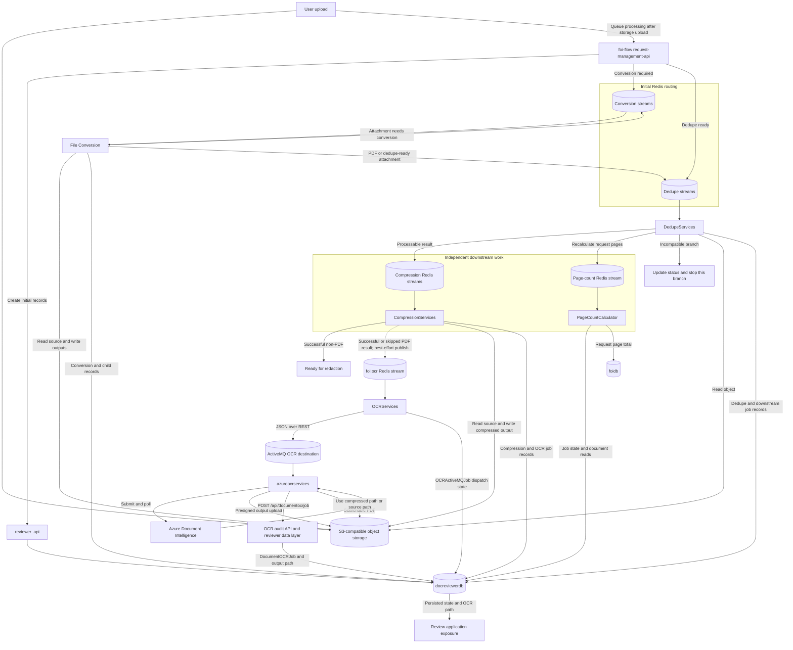
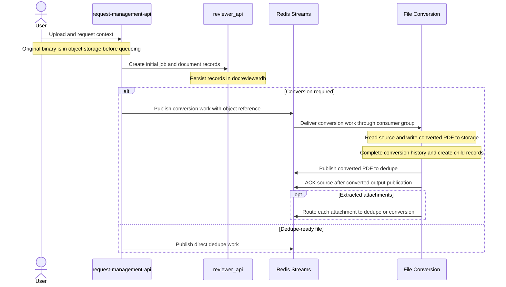
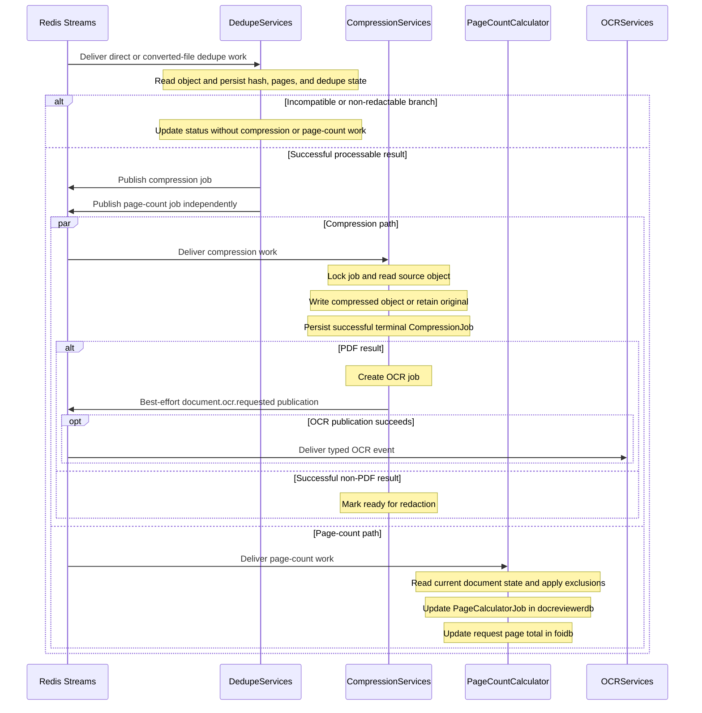
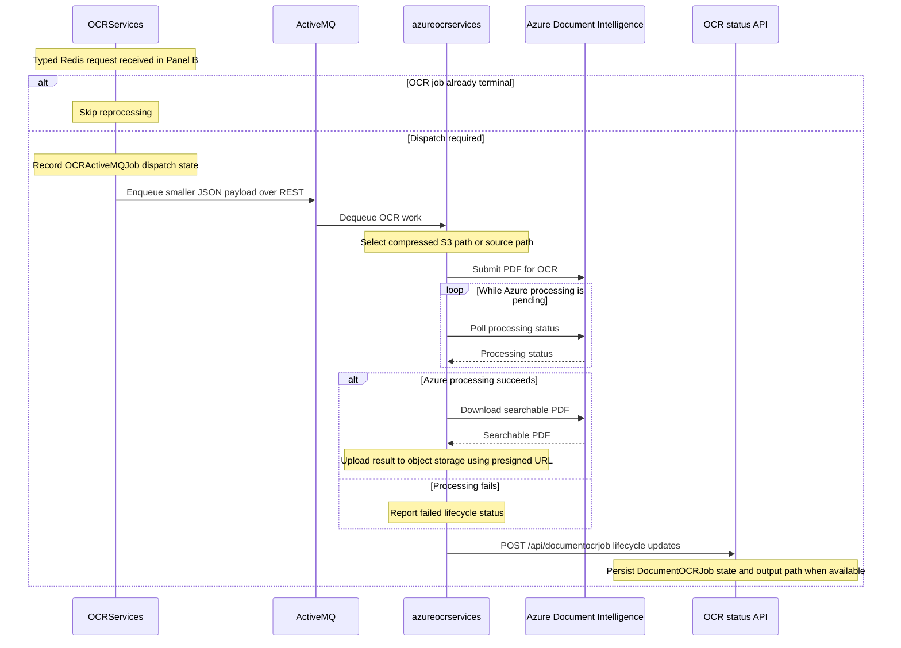

# FOI Current Document Processing Architecture

## Purpose and evidence boundary

Our current document-processing pipeline spans `foi-flow` and `foi-docreviewer`. The request-management application initializes processing records and queues work after upload. Workers exchange document references through Redis Streams, persist processing state in databases, and read and write document bytes in S3-compatible object storage. OCR adds an ActiveMQ handoff and Azure Document Intelligence processing.

This document establishes a shared understanding of the implementation described in the attached **Document Processing Message Flow** findings. It does not propose a target architecture. Repository paths in the source are retained for traceability; no independent repository or deployed-environment verification was performed. “Current” means the implementation described in those findings, not a claim that every environment runs the same configuration.

**The essential flow:** upload → optional conversion → dedupe → compression → OCR dispatch → Azure OCR → searchable PDF. Dedupe also starts page-count recalculation independently of compression. Conversion may create a tree of child documents and attachments.

## 1 Current architecture

### Applications and services

| Component | Repository or boundary | Current responsibility |
| --- | --- | --- |
| Upload and request-management application | `foi-flow` | Provides the upload/request context. The exact browser-to-storage upload protocol is not described. |
| `request-management-api` | `foi-flow` | Classifies uploaded files, asks `reviewer_api` to create initial job/document records, and publishes conversion or dedupe work. Selects normal or large-file routes. |
| `reviewer_api` | `foi-docreviewer` | Creates initial processing/document records and provides the review data layer. The findings associate OCR status persistence with the OCR audit API / `reviewer_api` data layer. |
| .NET File Conversion service | `foi-docreviewer` | Converts supported source formats to PDF, extracts attachments, creates child records, and routes outputs to dedupe or nested conversion. |
| `DedupeServices` | `foi-docreviewer` | Reads documents, computes hashes and page information, records dedupe/document state, and creates compression and page-count work for processable results. |
| `CompressionServices` | `foi-docreviewer` | Compresses a document or retains the preferable original, persists a terminal result, and requests OCR for PDFs. Successful non-PDF results are marked ready for redaction. |
| `PageCountCalculator` | `foi-docreviewer` | Recalculates request-level page totals from current document state and updates the ministry request. |
| `OCRServices` | `foi-docreviewer` | Consumes OCR requests from Redis, records dispatch state, and submits a smaller payload to ActiveMQ. |
| `azureocrservices` | `foi-docreviewer` | Consumes ActiveMQ work, calls and polls Azure Document Intelligence, downloads the searchable PDF, uploads it to object storage, and reports lifecycle status. |
| Review application | Review boundary | Can expose processing state and the OCR output path after status persistence. The retrieval/refresh mechanism is not specified. |

Conversion, dedupe, and compression have normal and large-file routes/deployments. These perform the same logical stages with different workload handling. Actual thresholds, replica counts, and environment-specific stream keys are not supplied.

### Infrastructure and durable state

| Resource | Contents and use | Writers identified in the findings |
| --- | --- | --- |
| S3-compatible object storage | Original uploads, converted PDFs, extracted attachments, compressed files, and searchable OCR PDFs | Upload path, File Conversion, Compression, Azure OCR services |
| Redis Streams | Work references and processing metadata between upload/conversion/dedupe/compression/page-count/OCR dispatch stages | `request-management-api` and upstream workers |
| ActiveMQ | Separate OCR execution queue after Redis dispatch | `OCRServices` publishes; `azureocrservices` consumes |
| `docreviewerdb` | Document identity, relationships, attributes, paths, hashes, readiness, and stage job histories | `reviewer_api` and processing workers |
| `foidb` | Ministry request data, including `FOIMinistryRequests.recordspagecount` | PageCountCalculator updates the aggregate |
| Azure Document Intelligence | External OCR processing and searchable-PDF generation | Called and polled by `azureocrservices` |

The findings do not identify database engines, the deployed object-storage product, cluster topology, or infrastructure versions. They should not be inferred from the database names or S3 compatibility.

### How request management connects to processing

By the time processing is queued, the original binary is already in object storage. `request-management-api` uses configured conversion, dedupe, and non-redactable file-type lists to classify the upload. It asks `reviewer_api` to create appropriate initial records **before** publishing a work item to Redis.

The API therefore initiates processing through a record-creation interaction plus an asynchronous work publication. Subsequent stage transitions are driven by workers, explicit messages, and durable job state. The findings do not describe request management synchronously waiting for the whole pipeline to finish.

## 2 Current document-processing flow

### Step 1 Upload and initial routing

**Producer and consumer.** The user uploads a record. `request-management-api` then produces work for either File Conversion or Dedupe, choosing the normal or large-file stream according to configured size thresholds.

**Data and storage.** Redis carries references and correlation data, not the binary: S3 path, ministry request ID, filename, batch, job ID, document master ID, trigger, attributes, and creator. The original stays in S3-compatible storage.

**State and completion.** `reviewer_api` creates the relevant initial job and document records. Conversion-required formats go to conversion; a PDF or other dedupe-ready format goes directly to dedupe. The findings mention a non-redactable classification list but do not fully describe every initial routing branch for those files.

**Failure.** Upload failure handling, initial record-creation failure handling, and initial Redis publish retries are not documented.

### Step 2 File Conversion when required

**Producer and consumer.** File Conversion consumes work published by `request-management-api`. It can also consume nested conversion work that File Conversion itself publishes for extracted attachments.

**Data and storage.** The incoming legacy flat message references the original object. Conversion writes the converted PDF and extracted attachments to object storage. An attachment already suitable for dedupe is sent there; an attachment needing conversion goes back to a conversion stream.

**State and completion.** The service completes `FileConversionJob` history, creates `DocumentMaster`, attribute, and child-job rows as needed, and publishes the converted PDF to dedupe. The original upload can consequently have multiple descendant documents. The consumer acknowledges its source Redis entry after publishing the converted output.

**Failure.** A conversion failure is recorded in `FileConversionJob`; that document is not published to dedupe. The findings do not specify the failed-entry ACK policy, conversion retry limits, recovery timing, or whether attachment failures affect sibling outputs.

### Step 3 Deduplication

**Producer and consumer.** Dedupe consumes direct-upload messages from `request-management-api` and converted-output or attachment messages from File Conversion.

**Data and storage.** Dedupe downloads the referenced object and computes its hash and page information. Duplicate detection uses stored document hashes; it is distinct from recognizing a redelivered message. The findings do not describe Dedupe writing a replacement binary.

**State and completion.** Dedupe records `DeduplicationJob` history and associates results with `DocumentMaster` / `Documents` state. For a successful, processable result, it creates and publishes two independent work items: compression and request-level page-count recalculation. Compression messages can use a legacy flat contract or a typed event, depending on deployment mode.

**Failure or branch termination.** Incompatible/non-redactable files have their status updated but do not launch compression or page count from that branch. The findings do not fully specify other dedupe failures, the complete duplicate-result branch, or how partial failure while publishing the two downstream jobs is handled. They describe the legacy Dedupe consumer as using a saved last-stream-ID checkpoint.

### Step 4A Compression

**Producer and consumer.** Dedupe creates compression work. A normal or large-file `CompressionServices` deployment consumes the appropriate workload queue.

**Data and storage.** Compression reads the source object. It writes a compressed result or records a skip when retaining the original is preferable. The findings identify the event type `document.compression.requested` v1 but do not provide its complete envelope/payload schema.

**State and completion.** Compression obtains a per-job database lock and uses versioned `CompressionJob` records to guard repeated delivery. After a successful terminal result, including a successful skip, a PDF causes creation of an OCR job and publication of `document.ocr.requested`. A successful non-PDF result is marked ready for redaction.

**Failure.** Unsuccessful compression does not satisfy the prerequisite for OCR. Standardized consumers have retry/reclaim, bounded-attempt, and dead-letter handling through `foi-messaging-go`; precise configuration is not given. A separate boundary exists after success: OCR publication is **best-effort**. A publication failure is logged but leaves the durable compression result unchanged. The findings do not describe a guaranteed reconciliation mechanism for that failed handoff.

### Step 4B Page counting in parallel

**Producer and consumer.** Dedupe publishes a separate flat page-count message for `PageCountCalculator`. Page counting does not wait for compression and is not a prerequisite for OCR.

**Data and storage.** The consumer reads current document/dedupe database state to calculate a request total. The exact queue payload is not provided. No new binary output is described.

**State and completion.** It tracks recalculation in `PageCalculatorJob` in `docreviewerdb` and writes `FOIMinistryRequests.recordspagecount` in `foidb`. The total excludes duplicates, portfolio records, incompatible records, and deleted documents.

**Failure.** The findings describe a saved-stream-ID checkpoint pattern but do not specify retries, ACKs, DLQ handling, or failed-recalculation recovery. This independent branch may run even if compression later fails.

### Step 5 OCR dispatch

**Producer and consumer.** Compression publishes the typed Redis event `document.ocr.requested` v1 on `foi:ocr`; `OCRServices` consumes it.

**Data and storage.** `OCRServices` sends a smaller JSON payload over the ActiveMQ REST endpoint to the configured OCR destination. The complete payload and destination name are not supplied. Document bytes remain in object storage.

**State and completion.** The dispatcher guards against reprocessing an already-terminal OCR job, creates/updates `OCRActiveMQJob` dispatch state, and enqueues execution work in ActiveMQ. Redis-to-ActiveMQ dispatch completion is distinct from completion of Azure OCR.

**Failure.** Standardized OCR consumption has retry/reclaim, bounded-attempt, and dead-letter behavior through `foi-messaging-go`. The findings do not specify the exact dispatch failure-state transitions, ACK location, or outcome of every ActiveMQ error.

### Step 6 Azure OCR and final output

**Producer and consumer.** `OCRServices` produces ActiveMQ work; `azureocrservices` consumes it and invokes Azure Document Intelligence.

**Data and storage.** The worker chooses the compressed S3 path when available, otherwise the source path. It submits the PDF to Azure, polls processing, downloads the searchable PDF, and uploads it to object storage through a presigned URL.

**State and completion.** It reports lifecycle statuses such as request created, running, succeeded, failed, and file-upload success through `POST /api/documentocrjob`. The OCR audit API / `reviewer_api` data layer persists `DocumentOCRJob` state and the output path. The review application can expose that path and processing state. The source does not establish the exact hosting relationship between the audit API and `reviewer_api`.

**Failure.** Failed lifecycle status is reported through the callback. ActiveMQ acknowledgement/redelivery behavior, Azure polling deadlines, upload retries, and callback retries are not specified. A successful Azure operation and successful output upload are separate reported lifecycle milestones.

## 3 Current communication model

### Asynchronous work contracts

| Work | Producer → consumer | Known stream or destination | Contract |
| --- | --- | --- | --- |
| Initial conversion | Request management → File Conversion | `EVENT_QUEUE_CONVERSION_STREAMKEY`; large-file equivalent not named | Legacy flat fields |
| Initial dedupe | Request management → Dedupe | `EVENT_QUEUE_DEDUPE_STREAMKEY`; large-file equivalent not named | Legacy flat fields |
| Converted-file dedupe | File Conversion → Dedupe | `DEDUPE_STREAM_KEY` | Legacy flat fields |
| Nested conversion | File Conversion → File Conversion | Conversion stream; exact selected key not supplied | Converted/extracted-item work; complete schema not supplied |
| Compression in legacy mode | Dedupe → Compression | `COMPRESSION_STREAM_KEY` | Legacy flat fields |
| Compression in standardized mode | Dedupe → Compression | `foi:compression` / `foi:compression-large` | `document.compression.requested` v1 |
| Page count | Dedupe → PageCountCalculator | `PAGECALCULATOR_STREAM_KEY` | Legacy flat fields |
| OCR dispatch | Compression → OCRServices | `foi:ocr` | `document.ocr.requested` v1 |
| OCR execution | OCRServices → azureocrservices | Configured ActiveMQ OCR destination; name not supplied | Smaller JSON payload over REST |

Environment-variable names are configuration references, not literal stream names. The findings explicitly allow environment differences. No consumer-group names, retry counts, DLQ keys, or complete standardized event schemas are supplied.

### API and storage interactions

| Interaction | Current behavior | Evidence limit |
| --- | --- | --- |
| Request management → `reviewer_api` | Creates initial job/document records before queuing | Endpoint and failure/transaction semantics not supplied |
| Workers → databases | Persist stage state, document metadata, and page totals | Not every worker's direct-database versus API write path is detailed |
| Workers ↔ S3-compatible storage | Read sources and write processed outputs | Provider, bucket/key conventions, and all access methods not supplied |
| OCRServices → ActiveMQ REST API | Enqueues JSON OCR payload | Endpoint configuration and acknowledgement semantics not supplied |
| azureocrservices ↔ Azure Document Intelligence | Submits, polls, and downloads OCR result | Model/API version and polling timeout not supplied |
| azureocrservices → object storage | Uploads searchable PDF using a presigned URL | Presigned-URL issuer and retry policy not supplied |
| azureocrservices → `/api/documentocrjob` | Posts OCR lifecycle state and output path | Exact audit API deployment boundary and callback retry policy not supplied |

These API interactions coexist with asynchronous queues. An HTTP request used to enqueue work or report status does not imply that the whole document pipeline executes synchronously.

## 4 Current reliability mechanisms

Reliability behavior differs by service and deployment mode. The findings support the following scope; they do not establish a uniform pipeline-wide policy.

| Mechanism | Supported current scope | Qualification |
| --- | --- | --- |
| Consumer groups | File Conversion; standardized Compression and OCR consumers | Group names/configuration not provided |
| ACK after downstream publication | Conversion acknowledges after publishing converted output | Do not generalize this to every stage or to all failure branches |
| Retry/reclaim behavior | Standardized Compression/OCR via `foi-messaging-go` | Exact error classification and timing not supplied |
| Bounded delivery attempts | Standardized Compression/OCR | Attempt limits not supplied |
| Dead-letter handling | Standardized Compression/OCR | DLQ names, retention, and replay procedure not supplied |
| Repeat-delivery protection | Compression uses a per-job database lock and terminal job version; OCRServices skips terminal jobs | No end-to-end exactly-once guarantee is established |
| Legacy progress checkpoints | Legacy Dedupe and PageCountCalculator save the last Redis stream ID | Not equivalent to documented consumer-group pending-message recovery |
| Durable business state | Document and job histories in databases | A completed stage does not by itself prove the next message was published |
| Dependency ordering | Converted output before dedupe; successful dedupe before compression; successful compression before OCR | Page counting remains independent |
| Workload separation | Normal/large conversion, dedupe, and compression routes | Exact capacity and timeout settings not supplied |

**ACK-after-success:** explicitly supported here for Conversion's acknowledgement after output publication. The findings do not locate the exact ACK point for standardized Compression/OCR, so this document does not assert a universal ACK-after-success policy.

**Worker-crash recovery:** reclaim behavior is reported for standardized consumers. The findings do not identify the Redis command, scan cursor behavior, minimum idle time, or crash scenarios tested. In particular, `XAUTOCLAIM` is **not explicitly established by this attachment**, so its deployment and configuration remain confirmation questions.

**Exponential backoff and processing timeouts:** neither a backoff algorithm nor concrete processing ceilings are supplied. The source says large-file routes affect timeout handling, but does not document the values. These are not presented as confirmed implementations.

## 5 Known issues and current limitations

### Confirmed problematic behavior described in the findings

**Compression can finish durably even when the OCR request publication fails.** OCR publication is best-effort and its failure is logged without reversing compression success. This is a documented handoff limitation. The attachment does not report incident frequency, affected-document counts, or whether an operational recovery procedure exists.

The attachment contains no separately evidenced production incident or measured outage. Other failure cases it describes are stage behaviors, not proof that those failures are currently occurring.

### Current limitations

| Limitation | What the findings establish |
| --- | --- |
| Mixed messaging contracts | Upload, conversion, dedupe, and page count use legacy flat maps. Compression supports legacy or typed modes. The Compression-to-OCR hop uses a typed event. |
| Mixed progress/recovery models | Legacy Dedupe and PageCountCalculator use stream checkpoints, while Conversion and standardized consumers use groups. |
| Multi-hop OCR lifecycle | Redis dispatch state in `OCRActiveMQJob` is distinct from Azure/output lifecycle state in `DocumentOCRJob`. |
| Multiple independently progressing branches | Attachments form child processing paths; page counting runs separately from compression/OCR. A single stage's completion is not the completion of every branch. |
| Batch notification is not orchestration | Dedupe can publish batch completion notification, but stage progression follows explicit work messages and job records. |

### Open questions rather than confirmed problems

The source does not explicitly identify active investigations. The following are evidence gaps to confirm with the team, not diagnosed defects:

- Which legacy versus standardized modes and literal stream/group names are deployed in each environment?
- What are the exact ACK, retry, backoff, reclaim, DLQ, and timeout settings for each consumer? Does the deployed recovery use `XAUTOCLAIM`?
- How is a logged Compression-to-OCR publication failure found and recovered operationally?
- What happens if initial database record creation succeeds but initial Redis publication fails, or only one of Dedupe's two downstream publications succeeds?
- What acknowledgement/redelivery and failure handling apply to ActiveMQ, Azure polling, result upload, and the OCR status callback?
- How does the review application determine and display completion across attachments, page counting, compression, and OCR? Where exactly is `/api/documentocrjob` hosted?

## 6 Current architecture diagram

Arrows show described communication and data access; queue labels represent logical routes, including normal/large variants where documented. The storage/database connections are grouped to keep the diagram readable; detailed writers are listed in section 1. A dashed link denotes the documented best-effort OCR publication, not a proposed connection.

The upload arrow does not assert a specific browser-to-S3 protocol. The review-application arrow represents availability of persisted information, not a claimed direct database connection. Audit API and reviewer nodes are logical responsibilities; their exact hosting relationship is not established.

## 7 Processing sequence

The sequence is split into three readable panels, each with at most five participants. Panels A through C describe one continuous logical flow. Persistent side effects are noted beside the responsible service. The normal success path is shown; failure boundaries follow the diagrams.

### Panel A Upload routing and conversion

### Panel B Dedupe and independent downstream jobs

### Panel C OCR dispatch execution and status

OCR callbacks are shown together for readability; they occur across the lifecycle, including created, running, succeeded/failed, and file-upload success. Their exact ordering relative to every external operation is not specified.

**Failure boundaries to explain alongside the sequence:** conversion failure is recorded and blocks that document's dedupe publication; incompatible dedupe results stop the dependent branch; failed compression does not qualify for OCR; successful compression can still have a failed best-effort OCR publication; independent page counting may already run; and OCR dispatch success does not mean Azure processing or output upload has completed. Exact ACK, retry, and recovery behavior remains service-specific as recorded in section 4.

## 8 Meeting summary

### What we have today

The following talk track is intended for approximately five minutes including a brief walkthrough of the diagrams.

“Our current document-processing pipeline spans two projects. `foi-flow` handles the request-management side and initiates processing. `foi-docreviewer` contains the review data layer and the workers for conversion, deduplication, compression, page counting, and OCR.

“The main separation is between document bytes, work messages, and business state. The bytes live in S3-compatible object storage. Redis Streams carry references to those objects and processing identifiers. Databases hold document relationships, paths, hashes, job history, and processing state. OCR adds ActiveMQ and Azure Document Intelligence.

“When a user uploads a record, the file is already in object storage before we queue processing. `request-management-api` classifies the file, asks `reviewer_api` to create the initial document and job records, and publishes either conversion work or dedupe work. We have normal and large-file routes for conversion, dedupe, and compression, selected using configuration.

“Conversion is conditional. A PDF or another dedupe-ready file goes straight to Dedupe. Office, email, calendar, and other conversion-required formats go through the .NET File Conversion service first. It writes a PDF, creates the related records, and sends the result to Dedupe. It can also extract attachments. Each attachment can go directly to Dedupe or back through conversion, so one uploaded record can produce a tree of documents.

“Dedupe reads the object, calculates its hash and page information, and records the result. Duplicate detection uses stored document hashes. For a successful processable result, Dedupe starts two independent jobs: compression and page-count recalculation. Incompatible or non-redactable results stop on their own status-update branch.

“That parallel split is important. Page counting does not wait for compression, and OCR does not wait for page counting. The page calculator uses current document state, excludes duplicates and other excluded record categories, and updates the request's aggregate page count in `foidb`.

“Compression reads the source and either writes a compressed output or keeps the original when that is preferable. It uses a job lock and versioned job records to protect repeated processing. After a successful terminal result, a PDF triggers an OCR request. A successful non-PDF result is marked ready for redaction.

“OCR has two queue hops. First, `OCRServices` consumes a typed Redis event, records dispatch state, and sends JSON work to ActiveMQ. Then `azureocrservices` consumes that work, selects the compressed file when available, calls and polls Azure Document Intelligence, downloads the searchable PDF, and uploads it to object storage. It reports status and the output path through the OCR status API. The review application can then expose those results.

“Our delivery behavior is currently mixed. The findings describe legacy checkpoint consumers for Dedupe and page counting, consumer groups for Conversion, and standardized retry, reclaim, bounded-attempt, and dead-letter handling for Compression and OCR. Compression supports both legacy and typed messaging modes. We should confirm which modes and settings are deployed in each environment.

“One documented limitation is that publishing OCR work after compression is best-effort. Compression can remain successfully completed even if that publish fails. We also distinguish OCR dispatch completion from Azure processing and output-upload completion. Today's discussion is to establish these boundaries and our existing operational behavior before considering changes.”

### Challenges and questions for the architect

- **Handoff visibility:** How do we currently detect and recover a failed OCR publication after successful compression?
- **Deployed delivery behavior:** What guarantees and configuration apply to each legacy or standardized consumer in each environment?
- **Completion semantics:** How do we currently determine that an upload and its attachments are ready when page counting and document processing progress independently?
- **OCR failure ownership:** Which component handles recovery at the Redis-to-ActiveMQ, Azure processing, output-upload, and status-callback boundaries?
- **Operational traceability:** Can we follow one document across all job histories and queue hops using the identifiers already available?

These questions describe current-system understanding and operational gaps. They do not prescribe a replacement broker, workflow engine, transaction pattern, or target architecture.

## Appendix A State ownership and tracing

| State | Identified writer or owner | Meaning |
| --- | --- | --- |
| `DocumentMaster`, `Documents`, `DocumentAttributes` | `reviewer_api` and workers | Document identity, parent/attachment relationships, paths, hashes, sizes, readiness |
| `FileConversionJob` | `reviewer_api` and File Conversion | Initial, started, completed, or error conversion history |
| `DeduplicationJob` | `reviewer_api` and Dedupe | Initial and terminal dedupe history |
| `CompressionJob` | Dedupe and Compression | Requested, started, and terminal compression history |
| `PageCalculatorJob` | Dedupe / `reviewer_api` and PageCountCalculator | Page recalculation tracking in `docreviewerdb` |
| `FOIMinistryRequests.recordspagecount` | PageCountCalculator | Request aggregate in `foidb` |
| `OCRActiveMQJob` | Compression and OCRServices | Redis-to-ActiveMQ dispatch tracking |
| `DocumentOCRJob` | Azure OCR status callback | Azure lifecycle and searchable-PDF output path |

Start with `ministryrequestid`, `batch`, `jobid`, and `documentmasterid`. Follow the initial conversion/dedupe job, child document identities, terminal dedupe state, linked compression and page-count state, OCR dispatch job, and finally the Azure OCR job/output path. Child processing creates related records; do not assume that every stage or attachment shares one unchanged job ID.

The source explicitly cautions against copying object paths, filenames, user tokens, or document contents into general-purpose diagnostics. Prefer numeric job/document identifiers and bounded status codes when tracing FOI records.

## Appendix B Source traceability

Primary evidence: the supplied `Pasted markdown(20260915-001448).md`, titled **Document Processing Message Flow**. All architectural claims and limitations above are drawn from that attachment; unknowns are explicitly marked.

Project references: [bcgov/foi-flow](https://github.com/bcgov/foi-flow) and [bcgov/foi-docreviewer](https://github.com/bcgov/foi-docreviewer).

The following repository paths were cited by the findings. They are navigation references, not independently verified code citations or pinned revisions.

| Area | Paths within the named repository |
| --- | --- |
| Upload and routing in `foi-flow` | `request-management-api/request_api/services/recordservice.py`; `request-management-api/request_api/services/external/eventqueueservice.py` |
| Conversion in `foi-docreviewer` | `MCS.FOI.S3FileConversion/MCS.FOI.S3FileConversion/Program.cs`; `MCS.FOI.S3FileConversion/MCS.FOI.S3FileConversion/DBHandler.cs` |
| Dedupe in `foi-docreviewer` | `computingservices/DedupeServices/services/foiredisdedupeconsumer.py`; `computingservices/DedupeServices/services/dedupeservice.py` |
| Compression in `foi-docreviewer` | `computingservices/CompressionServices/internal/compression/handler.go`; `computingservices/CompressionServices/internal/followup/ocr.go` |
| Page counting in `foi-docreviewer` | `computingservices/PageCountCalculator/services/pagecountservice/pagecountservice.py`; `computingservices/PageCountCalculator/services/dal/pagecount/ministryservice.py` |
| OCR dispatch in `foi-docreviewer` | `computingservices/OCRServices/internal/ocr/processor.go`; `computingservices/OCRServices/internal/activemq/client.go` |
| Azure OCR in `foi-docreviewer` | `computingservices/azureocrservices/azureservices/azureocrservice.go` |
