# Document Processing Message Flow

This document shows the big picture after a record is uploaded: which service
publishes each work message, which service consumes it, and how conversion,
deduplication, compression, page counting, and OCR are sequenced.

It describes the implementation visible in the repositories as of September
2026. Stream keys that are supplied through environment variables can differ by
environment.

## Big Picture

```mermaid
flowchart LR
    Upload[Record uploaded to object storage]
    RMA[request-management-api]
    ReviewAPI[reviewer_api]
    ConvertQ[(Conversion Redis stream)]
    Convert[File Conversion service]
    DedupeQ[(Dedupe Redis stream)]
    Dedupe[DedupeServices]
    CompressQ[(Compression Redis stream)]
    Compress[CompressionServices]
    PageQ[(Page-count Redis stream)]
    PageCount[PageCountCalculator]
    OCRQ[(foi:ocr Redis stream)]
    OCRDispatch[OCRServices]
    ActiveMQ[(ActiveMQ OCR queue)]
    AzureOCR[azureocrservices]
    Azure[Azure Document Intelligence]
    S3[(Object storage)]
    ReviewDB[(docreviewerdb job and document tables)]
    FOIDB[(foidb FOIMinistryRequests)]

    Upload --> RMA
    RMA -->|create initial job records| ReviewAPI
    ReviewAPI --> ReviewDB

    RMA -->|conversion-required format| ConvertQ
    ConvertQ --> Convert
    Convert -->|write converted PDF| S3
    Convert -->|publish converted PDF| DedupeQ

    RMA -->|dedupe-ready format| DedupeQ
    DedupeQ --> Dedupe
    Dedupe -->|hash and register document| ReviewDB
    Dedupe -->|publish in parallel| CompressQ
    Dedupe -->|publish in parallel| PageQ

    CompressQ --> Compress
    Compress -->|write compressed file| S3
    Compress -->|write job status| ReviewDB
    Compress -->|document.ocr.requested| OCRQ

    PageQ --> PageCount
    PageCount -->|read document state and write job status| ReviewDB
    PageCount -->|update request page count| FOIDB

    OCRQ --> OCRDispatch
    OCRDispatch -->|enqueue OCR payload| ActiveMQ
    ActiveMQ --> AzureOCR
    AzureOCR --> Azure
    Azure -->|searchable PDF| AzureOCR
    AzureOCR -->|write OCR PDF| S3
    AzureOCR -->|POST OCR status| ReviewAPI
```



The shortest way to read the flow is:

```text
Upload -> [Conversion, when required] -> Dedupe
       -> Compression -> OCR dispatch -> Azure OCR -> searchable PDF
       -> Page count (started by Dedupe in parallel with Compression)
```

Conversion is therefore a conditional step before dedupe. Compression and
page counting do not wait for each other. OCR is a follow-up to a successful or
skipped compression result for a PDF.

## The Two Upload Paths

`request-management-api` classifies the uploaded file using the configured
conversion, dedupe, and non-redactable file-type lists. It first asks
`reviewer_api` to create the appropriate initial job and document records, then
publishes the work item to Redis.

### Path A: a PDF or another dedupe-ready file

1. `request-management-api` publishes the upload directly to the normal or
   large-file dedupe stream.
2. `DedupeServices` reads the object, calculates its hash and page information,
   and saves the document details.
3. For a processable document, Dedupe creates and publishes both a compression
   job and a page-count job.
4. Compression writes or selects the usable document and then requests OCR for
   PDFs.

### Path B: an Office, email, calendar, or other conversion-required file

1. `request-management-api` publishes the original object to the normal or
   large-file conversion stream.
2. the .NET File Conversion service converts the object to PDF and writes the
   output to object storage.
3. File Conversion creates the child job/document records and publishes the
   converted PDF to the dedupe stream.
4. From that point, the PDF follows Path A.

File Conversion can extract attachments. An attachment that is already
dedupe-ready goes to Dedupe; an attachment that also requires conversion is
published back to the conversion stream. This creates a processing tree under
the original uploaded document.

## Publisher and Consumer Map

| Stage | Publisher | Message or transport | Consumer | Result / next message |
| --- | --- | --- | --- | --- |
| Initial routing | `request-management-api` `recordservice` | Flat Redis message on `EVENT_QUEUE_CONVERSION_STREAMKEY` or its large-file equivalent | .NET File Conversion service | Converted PDF and extracted attachments are saved; dedupe or nested conversion messages are published |
| Initial/direct dedupe | `request-management-api` `recordservice` | Flat Redis message on `EVENT_QUEUE_DEDUPE_STREAMKEY` or its large-file equivalent | `DedupeServices` | Hash/document state is recorded; compression and page-count messages are published |
| Converted-file dedupe | .NET File Conversion service | Flat Redis message on `DEDUPE_STREAM_KEY` | `DedupeServices` | Same outcome as direct dedupe |
| Compression | `DedupeServices` | Legacy flat stream (`COMPRESSION_STREAM_KEY`) **or** typed event `document.compression.requested` v1 on `foi:compression` / `foi:compression-large`, depending on deployment mode | Normal or large-file `CompressionServices` deployment | Compressed/skipped result is stored; PDF success triggers OCR |
| Page count | `DedupeServices` | Flat Redis message on `PAGECALCULATOR_STREAM_KEY` | `PageCountCalculator` | Recalculates and persists the ministry request's record-page total |
| OCR request | `CompressionServices` | Typed event `document.ocr.requested` v1 on `foi:ocr` | `OCRServices` | Creates/updates `OCRActiveMQJob`, then posts an OCR payload to ActiveMQ |
| OCR execution | `OCRServices` | JSON over the ActiveMQ REST endpoint to the configured OCR destination | `azureocrservices` | Calls Azure Document Intelligence, uploads the searchable PDF, and reports status |
| OCR status | `azureocrservices` | REST `POST /api/documentocrjob` | OCR audit API / `reviewer_api` data layer | Persists Azure OCR lifecycle state and the OCR output path |

The upload, conversion, dedupe, and page-count Redis contracts are legacy flat
field maps. Compression is in a migration period and supports either the legacy
flat stream or the standardized `foi-messaging-go` envelope. The OCR handoff
from Compression to `OCRServices` uses the standardized typed envelope.

## Stage Details

### 1. Upload and initial routing

The binary is already in S3-compatible object storage before processing is
queued. The work message carries references and correlation data rather than
the binary itself, including the S3 path, ministry request ID, filename, batch,
job ID, document master ID, trigger, attributes, and creator.

`request-management-api` selects normal versus large-file streams by configured
size thresholds. Normal and large-file deployments perform the same logical
work; they are separated to keep large documents from blocking ordinary ones.

Source: [`recordservice.py`](../../foi-flow/request-management-api/request_api/services/recordservice.py)
and [`eventqueueservice.py`](../../foi-flow/request-management-api/request_api/services/external/eventqueueservice.py).

### 2. Conversion

File Conversion consumes with a Redis consumer group. On success it:

- writes the converted PDF to object storage;
- completes the `FileConversionJob` history;
- creates `DocumentMaster`, attribute, and child job rows as needed;
- sends the converted PDF to Dedupe; and
- independently routes extracted attachments to Dedupe or back through
  conversion according to their format.

The conversion consumer acknowledges the source Redis entry after publishing
the converted output. A conversion failure is recorded in `FileConversionJob`
and does not publish that document to Dedupe.

Source: [`Program.cs`](../../foi-docreviewer/MCS.FOI.S3FileConversion/MCS.FOI.S3FileConversion/Program.cs)
and [`DBHandler.cs`](../../foi-docreviewer/MCS.FOI.S3FileConversion/MCS.FOI.S3FileConversion/DBHandler.cs).

### 3. Deduplication

`DedupeServices` downloads the referenced object, computes its hash and page
information, records the dedupe outcome, and associates the processed document
with `DocumentMaster`/`Documents` state. Duplicate detection is based on stored
document hashes rather than message identity.

After a successful, processable result, Dedupe publishes two independent units
of work:

- a compression request; and
- a request-level page-count recalculation.

Files flagged as incompatible/non-redactable stop on the incompatible branch:
their status is updated, but Dedupe does not launch compression or page count
from that branch.

Source: [`foiredisdedupeconsumer.py`](../../foi-docreviewer/computingservices/DedupeServices/services/foiredisdedupeconsumer.py)
and [`dedupeservice.py`](../../foi-docreviewer/computingservices/DedupeServices/services/dedupeservice.py).

### 4. Compression and page count

Compression consumes the workload-specific queue, obtains a per-job database
lock, and uses versioned `CompressionJob` rows to make repeat delivery safe. It
reads the source from object storage and either writes a compressed result or
records that compression was skipped when the original is already preferable.

Once the successful terminal state is confirmed:

- PDFs cause Compression to create an OCR job and publish
  `document.ocr.requested` to `foi:ocr`;
- a successful non-PDF result is marked ready for redaction instead.

The OCR publication is best-effort after the compression outcome is durable. A
publish failure is logged but does not change an already confirmed compression
result.

Page counting is a separate consumer. It reads current document/dedupe state,
excludes duplicates, portfolio records, incompatible records, and deleted
documents, then updates the aggregate page count for the ministry request.

Source: [`handler.go`](../../foi-docreviewer/computingservices/CompressionServices/internal/compression/handler.go),
[`ocr.go`](../../foi-docreviewer/computingservices/CompressionServices/internal/followup/ocr.go),
[`pagecountservice.py`](../../foi-docreviewer/computingservices/PageCountCalculator/services/pagecountservice/pagecountservice.py),
and [`ministryservice.py`](../../foi-docreviewer/computingservices/PageCountCalculator/services/dal/pagecount/ministryservice.py).

### 5. OCR dispatch and execution

OCR is split into two queue hops:

1. `OCRServices` consumes the typed Redis event, guards against reprocessing a
   terminal OCR job, records dispatch state in `OCRActiveMQJob`, and sends a
   smaller JSON payload to ActiveMQ.
2. `azureocrservices` dequeues the ActiveMQ message, chooses the compressed S3
   path when present (otherwise the source path), submits the PDF to Azure
   Document Intelligence, polls it, downloads the searchable PDF, and uploads
   that output through a presigned URL.

`azureocrservices` reports lifecycle statuses such as request created, running,
succeeded, failed, and file-upload success through `/api/documentocrjob`. The
review application can then expose the OCR path and processing state.

Source: [`processor.go`](../../foi-docreviewer/computingservices/OCRServices/internal/ocr/processor.go),
[`client.go`](../../foi-docreviewer/computingservices/OCRServices/internal/activemq/client.go),
and [`azureocrservice.go`](../../foi-docreviewer/computingservices/azureocrservices/azureservices/azureocrservice.go).

## State and Storage Responsibilities

| Resource | Owner / writer | Purpose |
| --- | --- | --- |
| Original and processed binaries | Request upload, File Conversion, Compression, and Azure OCR services | The queues carry paths; workers read and write the actual files in S3-compatible storage |
| `DocumentMaster`, `Documents`, `DocumentAttributes` | `reviewer_api` and processing workers | Stable document identity, parent/attachment relationships, paths, hashes, sizes, and review readiness |
| `FileConversionJob` | `reviewer_api` and File Conversion | Initial, started, completed, or error history for conversion |
| `DeduplicationJob` | `reviewer_api` and Dedupe | Initial and terminal deduplication history |
| `CompressionJob` | Dedupe and Compression | Requested workload plus started and terminal compression history |
| `PageCalculatorJob` | Dedupe / `reviewer_api` and PageCountCalculator | Tracks recalculation in `docreviewerdb` |
| `FOIMinistryRequests.recordspagecount` | PageCountCalculator | Stores the request-level aggregate in `foidb` |
| `OCRActiveMQJob` | Compression and `OCRServices` | Tracks the Redis-to-ActiveMQ OCR dispatch |
| `DocumentOCRJob` | Azure OCR status callback | Tracks Azure processing and the searchable-PDF output |

The database is the durable business view of processing. Redis and ActiveMQ
move work between services; object storage holds the document bytes.

## Ordering, Delivery, and Failure Boundaries

- **Required ordering:** conversion must finish before its output can be
  deduplicated; dedupe must finish before it requests compression; compression
  must reach a successful terminal state before it requests OCR.
- **Parallel work:** Dedupe launches compression and page counting separately.
  Page counting is not an OCR prerequisite.
- **Large files:** conversion, dedupe, and compression have normal and
  large-file routes/deployments. This changes capacity and timeout handling, not
  the business sequence.
- **Legacy delivery:** the legacy Dedupe consumer uses a saved last Redis stream
  ID. PageCountCalculator follows a similar checkpoint pattern.
- **Standard delivery:** standardized Compression/OCR consumers use consumer
  groups, retry/reclaim behavior, bounded attempts, and dead-letter handling
  supplied by `foi-messaging-go`.
- **Idempotency:** Compression guards work with the job ID and terminal job
  version; `OCRServices` skips an already-terminal OCR job. Workers must assume
  a message can be delivered again.
- **Stage isolation:** a failure prevents the next dependent message from being
  published, while independent work may already be running. For example, a
  page-count job can run even if compression later fails.
- **Batch notification is not orchestration:** Dedupe can publish a batch
  completion notification, but the actual stage transitions above are driven
  by explicit work messages and durable job records.

## How to Trace One Document

Start with the upload's `ministryrequestid`, `batch`, `jobid`, and
`documentmasterid`. Follow those identifiers through:

1. the initial `FileConversionJob` or `DeduplicationJob` row;
2. any converted output/attachment `DocumentMaster` children;
3. the `DeduplicationJob` terminal row;
4. the linked `CompressionJob` and, independently, page-count state;
5. `OCRActiveMQJob` for dispatch to ActiveMQ; and
6. `DocumentOCRJob` for Azure OCR status and the final searchable-PDF path.

Do not log or copy the object-storage path, filename, user token, or document
contents into general-purpose diagnostics. FOI records are sensitive; prefer
the numeric job/document identifiers and bounded status codes when tracing.
